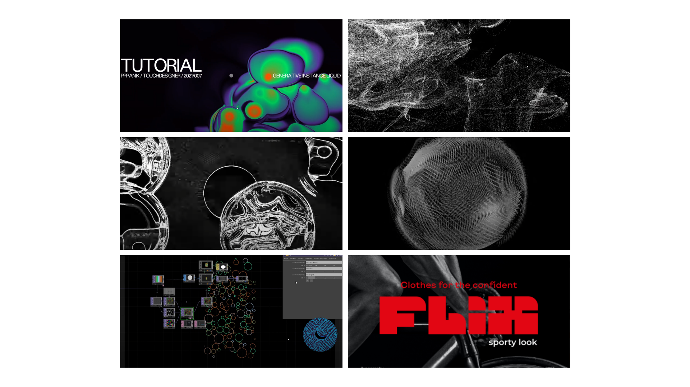
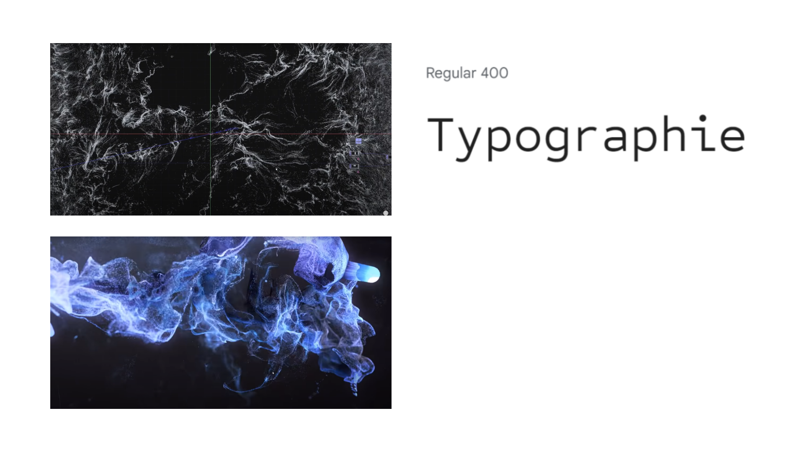
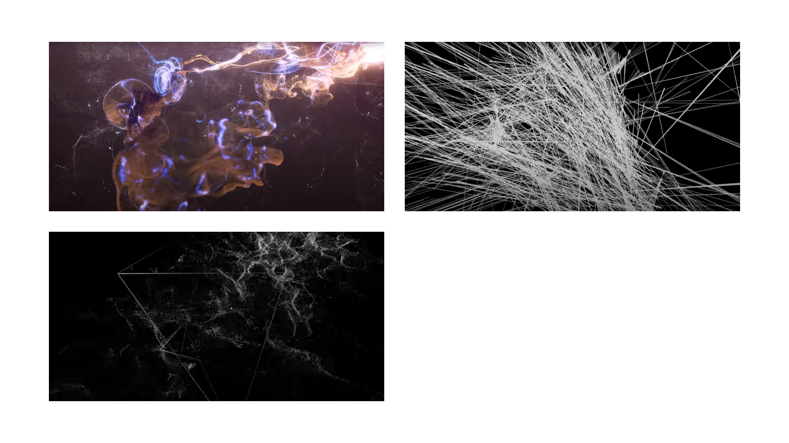
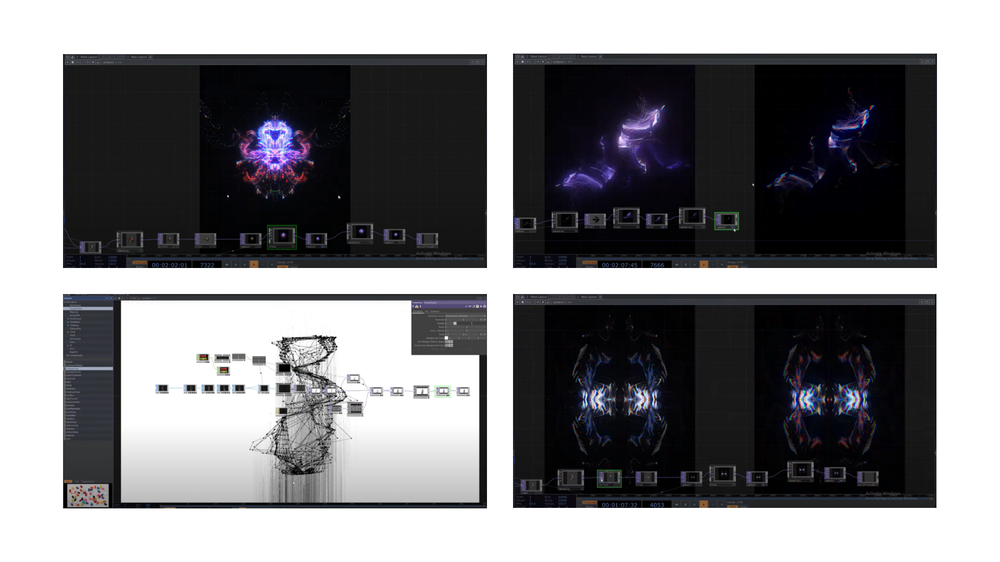
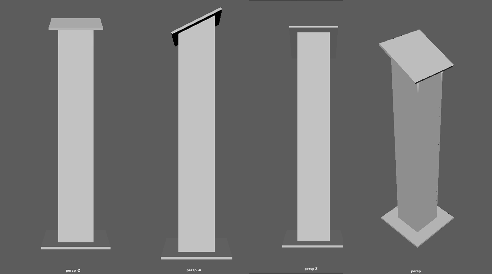

# Préproduction
> C'est ici qu'on dépose les éléments de la préproduction.

# Table des matières
1. [Intention ou concept](#Intention-ou-concept)
    - [Cartographie](#Cartographie)
    - [Intention de départ](#Intention-de-départ)
    - [Synopsis](#Synopsis)
    - [Moodboard](#Moodboard)
    - [Scénario, scénarimage ou document audio/visuel](#Scénario,-scénarimage-ou-document-audio/visuel)
2. [Contenu multimédia à intégrer](#Contenu-multimédia-à-intégrer)
    - [Inventaire du contenu multimédia](#Inventaire-du-contenu-multimédia)
    - [Univers artistique des éléments](#Univers-artistique-des-éléments-centraux)
3. [Planification technique d'un prototype (devis technique)](#Planification-technique-(devis-technique))
    - [Schémas ou plans techniques](#Schémas-ou-plans-techniques)
    - [Matériaux requis](#Matériaux-de-scénographie-requis)
    - [Équipements requis](#Équipements-requis)
    - [Logiciels requis](#Logiciels-requis)
    - [Ressources humaines requises](#Ressources-humaines-requises)
    - [Ressources spatiales requises (rangement et locaux)](#Ressources-spatiales-requises-(rangement-et-locaux))
    - [Contraintes techniques et potentiels problèmes de production](#Contraintes-techniques-et-potentiels-problèmes-de-production)
4. [Planification de la production d'un prototype (budget et étapes de réalisation)](#Planification-de-la-production-(budget-et-étapes-de-réalisation))
    - [Budget prévisionnel](#Budget-prévisionnel)
    - [Échéancier global](#Échéancier-global)
    - [Liste des tâches à réaliser](#Liste-des-tâches-à-réaliser)
    - [Rôles et responsabilités des membres de l'équipe](#Rôles-et-responsabilités-des-membres-de-l'équipe))
    - [Moments des rencontres d'équipe](#Moments-des-rencontres-d'équipe)

# Intention ou concept

## Intention de départ
Par ce projet, nous souhaitons pousser l'intéracteur à se déchaîner de toutes de forme de contrôle pour laisser place à la céation complète d'un monde immersif et interactif qui mène vers une expérience hyperstimulative.

## Synopsis
Sonalux est une expérience divisée en 3 chapitres qui se distinguent par leur intensité graduelle sonore et visuelle ainsi que leur environnement qui devient davantage chaotique et explosif de couleurs et de sons. Chaque chapitre comportera différents éléments sonores et visuels accompagnés d'une introduction écrite au tout début de chacun. De plus, le passage d'un chapitre à l'autre sera annoncé par la transition de couleurs des tubes LED. Le public est appelé à découvrir les différents chapitres qui composent le projet en explorant les diverses composantes de la boîte.

## Moodboard
### Moodboard pour le mode veille
> 
### Moodboard pour le chapitre 01
> 
### Moodboard pour le chapitre 02
> 
### Moodboard pour le chapitre 03
> 
### Exemples de paysages visuels génératifs
> [Circle packing - GLSL - (Touchdesigner tutorial)](https://www.youtube.com/watch?v=r3aOQMB7qiI)

> [Ocean of Particles . Part 1 . TouchDesigner](https://www.youtube.com/watch?v=wdAFCVKLG88)

> [audio-visual 1](https://www.youtube.com/watch?v=9ehYJY_W-OA)

> [Audio Visual "Particle and Rectangle"](https://www.youtube.com/watch?v=NsVl-C9X_Ho)

> [Audio reactive pseudo Voronoi made with TouchDesigner](https://www.youtube.com/watch?v=TOg9AAa832w)

> [Audio Visual "Particle becoming a line"](https://www.youtube.com/watch?v=GggxXKngdTA)

> [Heavier Than Heaven](https://www.youtube.com/watch?v=NQzKAPyHcTY)

> [Entering The Stronghold | Audio Visual Animation HD!](https://www.youtube.com/watch?v=0pXYp72dwl0)
 
> [particlewave (audio-reactive touchdesigner tutorial 001)](https://www.youtube.com/watch?v=ATLhkFcQZN0)

> [Generative Art | Particles in TouchDesigner](https://www.youtube.com/watch?v=3snFQtLRJqs&t=2s)
 
> [TOUCHDESIGNER TUTORIAL 21/007 INSTANCED GENERATIVE LIQUID](https://www.youtube.com/watch?v=MrkERTy7b6k)
 
> [Data Entropy. TouchDesigner Tutorial](https://www.youtube.com/watch?v=E9UjSuGu_Kw)

# Contenu multimédia à intégrer
## Inventaire du contenu multimédia

- 3 paysages visuels génératifs (TouchDesigner)
- 3 paysages sonores (VCV Rack)
- 6 modules multimédias (Captation des données (kinect/boite son), interprétation des données, contrôle des tubes LED, effets audiovisuels, contrôle vidéo/mapping projection, contrôle de la navigation utilisateur & des différents sous-modules).

# Planification technique d'un prototype (devis technique)
## Schémas ou plans techniques

### Schéma de plantation 
> 

### Image du podium
> 

### Schéma de branchement de l'installation
> 
### Schéma de branchement de la boîte sonore
> 

## Matériel de scénographie requis

* 4 toiles pour la rétroprojection
* Système d'accrochage au sol pour subdiviser l'endroit de déploiement/faux mur en toile

## Équipements requis

* Audio
    * 2 haut-parleurs actifs de 4"
    * 4 fils XLR 3 conducteurs de 15' (M->F)
    * Interface audio USB disposant 8 sorties et au moins 1 entrée
    * 5 casques d'écouteurs
    * Carte de son

* Vidéo
    * 5 projecteurs vidéo lentille grand angle 0.5
    * Kinect v1

* Lumière
    * 8 tubes LED

* Électricité
    * 4 cordon IEC (pour l'alimentation des haut-parleurs)
    * 2 extentions 3 fiches et 3 conducteurs 
    * 2 multiprises

* Réseau
    * 4 fils cat6a de 15"
    * Switch POE 5 ports

* Ordinateur
    * 1 ordinateur portable
    * 1 ordinateur sur chariot
 
* Arduino
    * 3 Atom Lite
    * 3 Atom POE
    * M5Stack 8-Encoder Unit (https://www.robotshop.com/products/8-encoder-unit-stm32f030)
    * 4 Key Unit
    * 2 PBHub
    * 1 GroveHub
    * 2 M5Stack Fader Unit w/ B10K Potentiometer (https://www.robotshop.com/products/m5stack-fader-unit-w-b10k-potentiometer-sk6812)
      
* Autre
    * Boîte sonore (à créer)
    * Podium (à créer)
  
## Logiciels requis

* [TouchDesigner](https://derivative.ca/UserGuide/TouchDesigner)
* [VCV Rack](https://vcvrack.com/)
* [Arduino IDE](https://www.arduino.cc/en/software)
* [Kinect v1.8 studio](https://www.microsoft.com/en-us/download/details.aspx?id=40278)

## Ressources humaines requises

* TTP, location de matériel
  
## Ressources spatiales requises (rangement et locaux)

* Grand studio
    * Rétroprojection vidéo dans le grand studio

## Contraintes techniques et potentiels problèmes de production

| Contrainte ou problème potentiel                                                                                                          | Solution envisagée                                                                                                              
|-------------------------------------------------------------------------------------------------------------------------------------------|-------------------------------------------------------------------------------------------------------|
| Apprendre et maîtriser un tout nouveau logiciel, soit TouchDesigner                                                                       | Expérimentation durant la session |                                                                                             
| Apprendre à utiliser la kinect pour la captation live                                                                                     | Expérimentation durant la session et documentation sur le web |                                                                 
| Réaliser la boîte sonore et intégrer les différentes composantes, c’est-à-dire analogues (sortie audio) et électriques (microcontrôleurs) | Acheter le matériel nécéssaire |
| Relier la boîte au reste de l’installation                                                                                                | Faire plusieurs itérations de visuel pour que le visuel et le son se complémentent et intéragissent bien ensemble |

# Planification de la production d'un prototype (budget et étapes de réalisation)
## Budget prévisionnel
Construire la boîte de sons et intégrer toutes ces différentes composantes servant à créer du son (150$)

## Rôles et responsabilités des membres de l'équipe

**Vincent Desjardins**
- Coordination technique et artistique du projet
- Création du module d'interprétation des données (Kinect)
- Programmation du patch touchdesigner de génération vidéo

**Camélie Laprise**

- Coordination technique du projet (coordination de l'échéancier, du budget, suivi de la liste des tâches à réaliser, s'assurer de la répartition du rôle et des responsabilités des membres de l'équipe)
- Création des paysages sonores
- Créations de visuels
- Installation de l'équipement dans l'espace physique

**Ghita Alaoui**
- Création de visuels
- Mapping
- Installation de l'équipement dans l'espace physique

**Antoine Haddad**
- Installation de l'équipement dans l'espace physique
- Coordination des projections/projecteurs
- Création du boîtier interactif au milieu de l'installation
