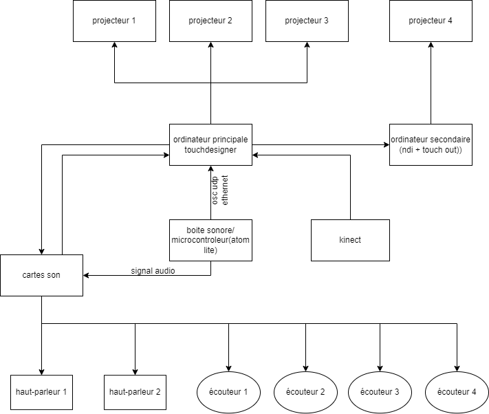
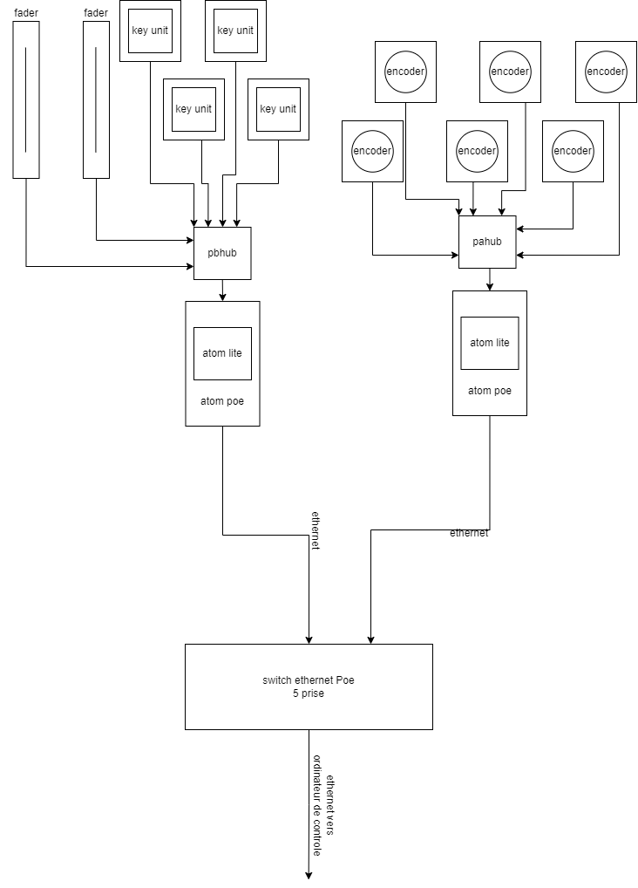

# Préproduction
> C'est ici qu'on dépose les éléments de la préproduction.

# Table des matières
1. [Intention ou concept](#Intention-ou-concept)
    - [Cartographie](#Cartographie)
    - [Intention de départ](#Intention-de-départ)
    - [Synopsis](#Synopsis)
    - [Moodboard visuel](#Moodboard-visuel)
    - [Moodboard sonore](#Moodboard-sonore)
2. [Contenu multimédia à intégrer](#Contenu-multimédia-à-intégrer)
    - [Inventaire du contenu multimédia](#Inventaire-du-contenu-multimédia)
    - [Univers artistique des éléments](#Univers-artistique-des-éléments-centraux)
3. [Planification technique d'un prototype (devis technique)](#Planification-technique-(devis-technique))
    - [Schémas ou plans techniques](#Schémas-ou-plans-techniques)
    - [Installation](#Installation)
    - [Matériaux requis](#Matériaux-de-scénographie-requis)
    - [Équipements requis](#Équipements-requis)
    - [Rôle des composantes de M5Stack](#Rôle-des-composantes-de-M5Stack)
    - [Logiciels requis](#Logiciels-requis)
    - [Ressources humaines requises](#Ressources-humaines-requises)
    - [Ressources spatiales requises (rangement et locaux)](#Ressources-spatiales-requises-(rangement-et-locaux))
    - [Contraintes techniques et potentiels problèmes de production](#Contraintes-techniques-et-potentiels-problèmes-de-production)
4. [Planification de la production d'un prototype (budget et étapes de réalisation)](#Planification-de-la-production-(budget-et-étapes-de-réalisation))
    - [Budget prévisionnel](#Budget-prévisionnel)
    - [Échéancier global](#Échéancier-global)
    - [Liste des tâches à réaliser](#Liste-des-tâches-à-réaliser)
    - [Rôles et responsabilités des membres de l'équipe](#Rôles-et-responsabilités-des-membres-de-l'équipe))
    - [Moments des rencontres d'équipe](#Moments-des-rencontres-d'équipe)
5. [Direction artistique](#Direction-artistique)
    - [Semaine 1](#Semaine-1)
    - [Semaine 2](#Semaine-2)

# Intention ou concept

## Intention de départ
Par ce projet, nous souhaitons pousser l'interacteur à se déchaîner de toutes de forme de contrôle pour laisser place à la céation complète d'un monde immersif et interactif qui mène vers une expérience hyperstimulative. De plus, le but de Sonalux est de repenser les idées préconçues d'un studio de musique dans un esthétique psychédélique qui permet de rendre l'installation accessible pour tout le monde. 

## Synopsis
Sonalux est une expérience divisée en 3 tableaux qui se distinguent par leur intensité graduelle sonore et visuelle ainsi que leur environnement qui devient davantage chaotique et explosif de couleurs et de sons. Le public est appelé à découvrir les particularités des différents tableaux qui composent le projet en explorant les diverses composantes de la boîte.

## Moodboard visuel

### Moodboard pour le mode veille
> 
### Moodboard pour le tableau 01
> 
### Moodboard pour le tableau 02
> 
### Moodboard pour le tableau 03
> 
### Exemples de paysages visuels génératifs
> [Circle packing - GLSL - (Touchdesigner tutorial)](https://www.youtube.com/watch?v=r3aOQMB7qiI)

> [Ocean of Particles . Part 1 . TouchDesigner](https://www.youtube.com/watch?v=wdAFCVKLG88)

> [audio-visual 1](https://www.youtube.com/watch?v=9ehYJY_W-OA)

> [Audio Visual "Particle and Rectangle"](https://www.youtube.com/watch?v=NsVl-C9X_Ho)

> [Audio reactive pseudo Voronoi made with TouchDesigner](https://www.youtube.com/watch?v=TOg9AAa832w)

> [Audio Visual "Particle becoming a line"](https://www.youtube.com/watch?v=GggxXKngdTA)

> [Heavier Than Heaven](https://www.youtube.com/watch?v=NQzKAPyHcTY)

> [Entering The Stronghold | Audio Visual Animation HD!](https://www.youtube.com/watch?v=0pXYp72dwl0)
 
> [particlewave (audio-reactive touchdesigner tutorial 001)](https://www.youtube.com/watch?v=ATLhkFcQZN0)

> [Generative Art | Particles in TouchDesigner](https://www.youtube.com/watch?v=3snFQtLRJqs&t=2s)
 
> [TOUCHDESIGNER TUTORIAL 21/007 INSTANCED GENERATIVE LIQUID](https://www.youtube.com/watch?v=MrkERTy7b6k)
 
> [Data Entropy. TouchDesigner Tutorial](https://www.youtube.com/watch?v=E9UjSuGu_Kw)

## Moodboard sonore

> [First Cell - Lucy](https://www.youtube.com/watch?v=XCI8FCjZwtg&list=OLAK5uy_lkCzCeDWNnNVo0F90-yia8ZR3UT2cpLFA&index=2)

> [Patch Notes: Hélène Vogelsinger](https://www.youtube.com/watch?v=kYxheEGl2oM)

> [Stranger Things - Theme](https://www.youtube.com/watch?v=2obv0DHuhu4)

> [Mike Dean | Three Jewels](https://www.youtube.com/watch?v=y3QgXLLX_Rs)

> [Aaron Batzdorff - TikTok](https://www.tiktok.com/@aaronbatzdorff/video/7256329924485582122)

# Contenu multimédia à intégrer
## Inventaire du contenu multimédia

- 5 paysages visuels génératifs (TouchDesigner)
- 4 paysages sonores (VCV Rack)
- 6 modules multimédias (Captation des données (kinect/boite son), interprétation des données, contrôle des tubes LED, effets audiovisuels, contrôle vidéo/mapping projection, contrôle de la navigation utilisateur & des différents sous-modules).

# Planification technique d'un prototype (devis technique)
## Schémas ou plans techniques

### Schéma de plantation 
> 

### Image du podium
> 

### Schéma de branchement de l'installation
> 
### Schéma de branchement de la boîte sonore
> 

## Installation
L'expérience se déroule entre 3 murs blancs, dont deux qui sont mobiles. Dans les herses, il y a deux hauts-parleurs ainsi que 4 projecteurs et une Kinect accrochés afin de projeter un son ambiant, trois projections et opérer une captation de présence. Au centre de l'installation se trouve un podium qui sert à contrôler les différents paysages sonores et visuels de l'expérience. Pour ce faire, l'interacteur devra utiliser une boite qui est posée au dessus du podium et qui est composée de différentes composantes M5Stack : Atom Lite, Atom POE, Encoder, Key Unit, PBHub, GroveHub, M5Stack Fader Unit w/ B10K Potentiometer. Le podium sera décoré de LED tout autour qui réagiront au fil de l'interaction.

## Matériel de scénographie requis

* 2 murs mobiles
* Rideau noir

## Équipements requis

* Audio
    * 2 haut-parleurs actifs de 4"
    * 4 fils XLR 3 conducteurs de 15' (M->F)
    * Interface audio USB disposant 8 sorties et au moins 1 entrée
    * 4 casques d'écouteurs
    * Carte de son

* Vidéo
    * 4 projecteurs vidéo lentille grand angle 0.5
    * Kinect v1

* Lumière
    * Bandes autocollantes LED

* Électricité
    * 4 cordon IEC (pour l'alimentation des haut-parleurs)
    * 2 extentions 3 fiches et 3 conducteurs 
    * 2 multiprises

* Réseau
    * 4 fils cat6a de 15"
    * Switch POE 5 ports

* Ordinateur
    * 1 ordinateur portable
    * 1 ordinateur sur chariot
 
* M5Stack
    * 2 Atom Lite
    * 2 Atom POE
    * 6 Encoder
    * 4 Key Unit
    * 2 PBHub
    * 1 GroveHub
    * 2 M5Stack Fader Unit w/ B10K Potentiometer (https://www.robotshop.com/products/m5stack-fader-unit-w-b10k-potentiometer-sk6812)
      
* Autre
    * Boîte sonore (à créer)
    * Podium (à créer)

## Rôle des composantes de M5Stack

Encoder :
* Mélodie qui change de gamme
* Reverb
* Dry\Wet Reverb
* Changement de Noise (White, Brown, Red, etc.)
* Changement de Wave form.
* Attack
* Release
* Timbre\Harmonic
  
Key Unit (Toggle) :
* Bass lignes
* Hat
* Kick
* Snare
  
Fader :
* Changement de vitesse\Tempo
* Volume
  
## Logiciels requis

* [TouchDesigner](https://derivative.ca/UserGuide/TouchDesigner)
* [VCV Rack](https://vcvrack.com/)
* [Arduino IDE](https://www.arduino.cc/en/software)
* [Kinect v1.8 studio](https://www.microsoft.com/en-us/download/details.aspx?id=40278)

## Ressources humaines requises

* TTP, location de matériel
  
## Ressources spatiales requises (rangement et locaux)

* Grand studio
    * Rétroprojection vidéo dans le grand studio

## Contraintes techniques et potentiels problèmes de production

| Contrainte ou problème potentiel                                                                                                          | Solution envisagée                                                                                                              
|-------------------------------------------------------------------------------------------------------------------------------------------|-------------------------------------------------------------------------------------------------------|
| Apprendre et maîtriser un tout nouveau logiciel, soit TouchDesigner                                                                       | Expérimentation durant la session |                                                                                             
| Apprendre à utiliser la kinect pour la captation live                                                                                     | Expérimentation durant la session et documentation sur le web |                                                                 
| Réaliser la boîte sonore et intégrer les différentes composantes, c’est-à-dire analogues (sortie audio) et électriques (microcontrôleurs) | Acheter le matériel nécéssaire |
| Relier la boîte au reste de l’installation                                                                                                | Faire plusieurs itérations de visuel pour que le visuel et le son se complémentent et intéragissent bien ensemble |

# Planification de la production d'un prototype (budget et étapes de réalisation)
## Budget prévisionnel
Construire le podium et la boîte de sons et intégrer toutes ces différentes composantes servant à créer du son (200$)

## Rôles et responsabilités des membres de l'équipe

**Vincent Desjardins**
- Coordination technique et artistique du projet
- Création du module d'interprétation des données (Kinect)
- Programmation du patch touchdesigner de génération vidéo
- creation du module sonore generatif et interactif dans vcv rack

**Camélie Laprise**
- Coordination technique du projet (coordination de l'échéancier, du budget, suivi de la liste des tâches à réaliser, s'assurer de la répartition du rôle et des responsabilités des membres de l'équipe)
- Création des paysages sonores
- Créations de visuels
- Installation de l'équipement dans l'espace physique

**Ghita Alaoui**
- Création de visuels
- Création des paysages sonores
- Mapping
- Installation de l'équipement dans l'espace physique

**Antoine Haddad**
- Installation de l'équipement dans l'espace physique
- Coordination des projections/projecteurs
- Création du boîtier interactif au milieu de l'installation

# Direction artistique 

## Semaine 1

### Nom d'équipe

Miray

### Nom de projet

Sonalux

### Public cible

Explorateur

### Comportement
L’interacteur est amené à découvrir l’expérience en entrant dans la zone délimitée qui offre au sol une projection impactée par les déplacements de l’interacteur. Ce dernier est ensuite poussé à se diriger vers le podium pour manipuler de manière tactile les diverses composantes mises à sa disposition et ainsi créer sa propre composition sonore et visuelle. 

### Esthétique
L’esthétique psychédélique des paysages sonores et visuels obligent l’interacteur à se déchaîner, car il n’a aucune référence sur ce qu’il voit et ce qu’il entend. Il découvre un monde sans contraintes inconnu du monde présent.

### Espace
L’installation se présente comme une enceinte afin de mettre l’accent sur l’aspect immersif. De plus, l’espace permet d’accueillir plusieurs utilisateurs afin qu’ils découvrent l'espace virtuel et voyagent ensemble dans celui-ci menant vers une toute nouvelle expérience représentée comme étant un voyage astral. 

### Temps
Le temps se présente sous la forme de ***kairos***, abandonnant complètement son autre forme du nom de ***chronos***. La notion de temps devient subjective, car on se perd en plongeant dans le plan de la conscience où le temps s'écoule différemment pour les utilisateurs.

### Quelles émotions voulez-vous faire vivre à l’interacteur ?

* Euphorie sensorielle
* Hyperstimulation

### Pourquoi ?
Nous souhaitons pousser l'intéracteur à se déchaîner de toutes de forme de contrôle pour laisser place à la céation complète d'un monde immersif et interactif.

### Quelles questions votre projet met-il dans l’esprit de l’interacteur ?

* S’abandonner à quelque chose de nouveau est-il bénéfique pour soi-même ?
* Est-ce que je peux parvenir à créer quelque chose par moi-même ?
* Est-ce que la nouveauté est une chose effrayante ?
* Est-ce un bon moyen de sortir de sa zone de confort ?

### Que devrez-vous faire pour qu’il ait envie de réponde à ces questions ?
Proposer une expérience nouvelle dont le public cherche à découvrir et leur permettant de s’amuser sans penser et réfléchir aux répercussions de leurs gestes les poussant davantage vers une créativité qui leur est unique. 

## Semaine 2

### Tous les verbes disponibles à vos interacteurs. 
* Se déplacer
* Peser
* Tourner
* Glisser
* Écouter

### Tous les objets sur lesquels chaque verbe peut agir et comment ils le font ?
* Sol
* Key Unit
* Encoder
* Fader
* Casque d'écouteurs

### Plusieurs actions émergentes que vous aimeriez que vos interacteurs effectuent.
#### Modifications sonores
Key Unit (Toggle) :
* Bass lignes
* Hat
* Kick
* Snare
  
Encoder :
* Mélodie qui change de gamme
* Reverb
* Dry\Wet Reverb
* Changement de Noise (White, Brown, Red, etc.)
* Changement de Wave form.
* Attack
* Release
* Timbre\Harmonic
  
Fader :
* Changement de vitesse\Tempo
* Volume
  
#### Modifications visuelles
* Projection au sol suit les déplacements de l'interacteur
* Projections au mur modifiées par les actions commises par l'interacteur aux composantes

#### Modifications lumineuses 
* Jeu des lumières impacté par les actions commises par l'interacteur aux composantes
* Couleur des lumières influencée par les actions commises par l'interacteur aux composantes

### Toutes les façons que les interacteurs peuvent faire progresser l'expérience.
* Se déplacer à travers l'environnement délimitée pour le projet
* Expérimenter les différentes composantes associées à la boîte sonore
